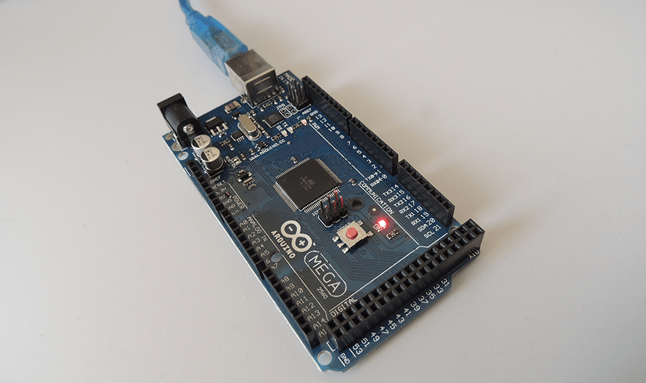

Arduino Mega 2560
========
The shortest ATMEGA2560 program that outputs "Hello, World!" to serial console. It is used to make sure an Arduino Mega 2560 board is working.

Arduino IDE ReadMe
------------
[Serial/Print](https://www.arduino.cc/en/Serial/Print)

[Serial/Println](https://www.arduino.cc/en/Serial/Println)

[ATMEGA2560 IC Pinout](https://www.arduino.cc/en/Hacking/PinMapping2560)

[Arduino Mega 2560 Shop](https://www.arduino.cc/en/Main/arduinoBoardMega2560/)

[PWM tutorial](https://www.arduino.cc/en/Tutorial/PWM)

[PWM fade](https://www.arduino.cc/en/Tutorial/Fading)